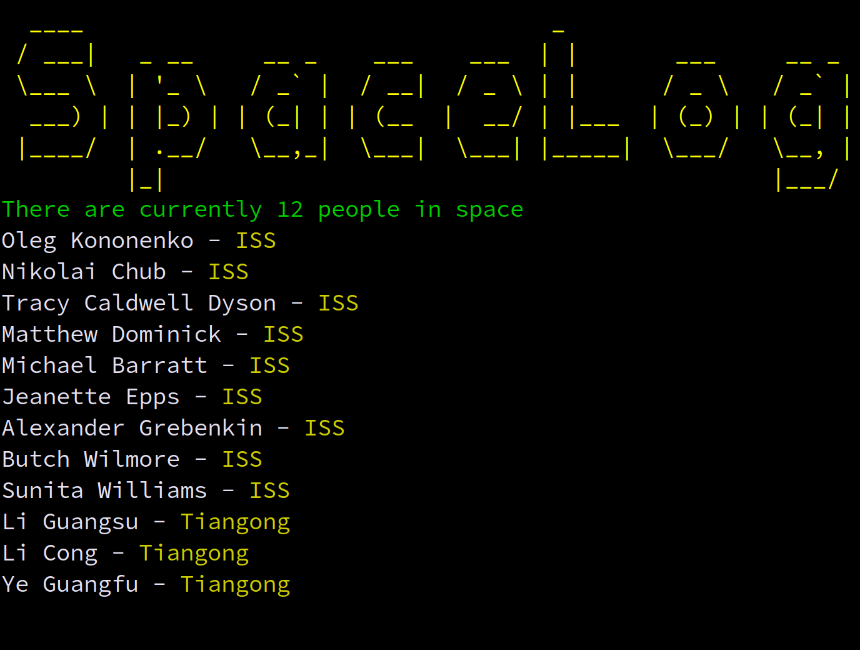

# Spacelog

<em>A simple CLI program that logs the names of people in space - to learn TypeScript in Node.js.</em>

## Preview

- Clone the repository: `git clone <repo url>`
- Start the project: `pnpm install && pnpm start`
